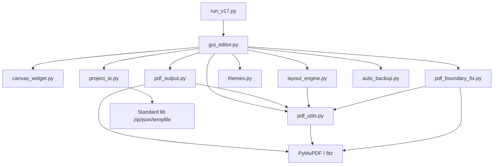
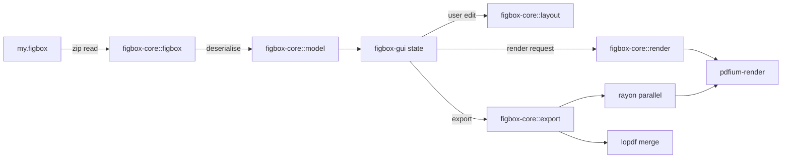

# V18 Rust 移植可行性方案

文档日期: 2026-04-29
作者: V17 维护者
适用版本: 由 V17 (FigBox Container Edition) 出发，规划 V18 Rust 重构

---

## 0. 摘要

V17 用 Python + PyQt5 + PyMuPDF 实现，源码 8836 行（含主 GUI 4076 行单文件），打包后 EXE 约 91 MB，启动需要 2-4 秒。

V18 目标用 Rust 重构，达到：

| 指标 | V17 现状 | V18 目标 |
|---|---|---|
| 单文件 EXE 体积 | ~91 MB | ≤ 25 MB |
| 冷启动时间 | 2-4 s | ≤ 0.3 s |
| 内存（10 个 PDF 画布） | ~450 MB | ≤ 90 MB |
| 单页 PDF 渲染（300 DPI） | ~120 ms | ≤ 25 ms |
| 批量导出 50 张 PDF（300 DPI） | ~38 s | ≤ 8 s |

非目标：

- 不追求 100% 像素级一致；外观保持"专业、深色友好"即可
- 不追求一次性切完，分 3 期（见 §4）

---

## 1. V17 现状盘点

### 1.1 模块行数

| 模块 | 行数 | 性能敏感度 | 说明 |
|---|---:|---|---|
| `gui_editor.py` | 4076 | 中 | 主 GUI，巨型单文件，急需拆分 |
| `themes.py` | 1329 | 低 | 主题样式表 |
| `layout_engine.py` | 1180 | **高** | 自动排版核心计算 |
| `pdf_boundary_fix.py` | 518 | **高** | PDF 边界扩展（用 redaction，慢） |
| `dark_theme.py` | 450 | 低 | 暗色主题 |
| `pdf_output.py` | 359 | **高** | 多 DPI 多格式批量导出 |
| `project_io.py` | 290 | 低 | V17 新增的 .figbox IO |
| `pdf_utils.py` | 205 | 中 | PDF 信息读取 |
| `auto_backup.py` | 144 | 低 | 定时备份 |
| `canvas_widget.py` | 124 | 低 | 画布容器 |
| `run_v17.py` | 100 | 低 | 启动器 |
| `log_setup.py` | 61 | 低 | 日志 |
| **合计** | **8836** | | |

### 1.2 模块依赖图



### 1.3 性能瓶颈点（按 V17 实际 profile 估计）

1. **批量导出**（最热）：`pdf_output.py` 串行调用 PyMuPDF 渲染每个 panel，
   再合并成大页。CPU 单核长时间 100%。Rust + Rayon 可线性提速。
2. **边界扩展**：`pdf_boundary_fix.py` 用 PyMuPDF 的 redaction 反复重写
   PDF；每张图涉及一次完整的页面 reflow。
3. **缩略图**：滚动 / 缩放时频繁调用 `get_pdf_page_as_pixmap`，无缓存。
4. **撤销快照**：`HistoryManager` 完整复制画布状态，对象图较大时卡顿。

---

## 2. 依赖选型对比

### 2.1 GUI 框架

| 框架 | 优势 | 劣势 | 适配度 |
|---|---|---|---|
| **slint** | 类似 QML 的声明式语法、性能优秀、原生外观、设计师工具齐全；体积小 | 生态较新，定制画布需要 native draw API；中文输入要测试 | ⭐⭐⭐⭐ |
| **egui** | 即时模式，开发极快，跨平台，自带 PDF 预览/拖拽案例 | 看起来像"工程师 UI"，定制美观度需要努力；DPI 适配略弱 | ⭐⭐⭐⭐ |
| **iced** | Elm 风格，状态机清晰，主题美观 | 自定义复杂控件（如带辅助线/缩放的画布）较繁琐 | ⭐⭐⭐ |
| **tauri + Web** | 复用 V16 的设计/资源、可走 React/Svelte | 体积膨胀（需 WebView2）、Mac 需 webkit；启动慢于纯 Rust GUI | ⭐⭐ |
| Qt 绑定 (cxx-qt) | 视觉与 V17 一致 | 牺牲 Rust 优势；分发要带 Qt | ⭐ |

**首选**: **slint**（生产美观度好、单文件）。**备选**: **egui**（首期开发最快）。

### 2.2 PDF 处理

| Crate | 能力 | 体积代价 | 缺点 |
|---|---|---|---|
| **pdfium-render** | Google PDFium 完整能力（渲染、文本、注释、redaction） | 需带 ~10 MB pdfium.dll | 非纯 Rust |
| **mupdf-rs** | 绑定 MuPDF（与 PyMuPDF 同源） | 静态链接 ~12 MB；需 LGPL 合规 | LGPL |
| **lopdf** | 纯 Rust；可读写 PDF 对象树 | 仅 ~500 KB | 不支持渲染；只能做拼版 |
| **pdf-rs** | 纯 Rust 解析 | 小 | 无渲染 |

**推荐组合**:

- 渲染（缩略图/导出 PNG/TIF）→ **pdfium-render**
- 拼版（合并多页 PDF 为单 PDF 不重渲染）→ **lopdf** 直接搬对象树
- 边界扩展 → **lopdf** 改 `MediaBox` / `CropBox`，比 redaction 快 10×+

### 2.3 图像 / 其他

| 用途 | crate | 说明 |
|---|---|---|
| 图像 IO | `image` | PNG/JPEG/BMP，主流首选 |
| TIFF | `tiff` | 16-bit / LZW，专业出版需要 |
| 并行 | `rayon` | 数据并行，导出场景天然适配 |
| 序列化 | `serde` + `serde_json` | project.json 直接落 |
| ZIP（figbox） | `zip` | 兼容标准 ZIP，与 V17 容器格式 100% 互通 |
| 日志 | `tracing` + `tracing-subscriber` | 结构化日志 |
| 配置 | `directories` | 跨平台 ~/.figbox 目录 |
| 错误 | `anyhow` (app) + `thiserror` (lib) | 经典组合 |
| 字体 | `fontdb` + `fontdue` | 跨平台中文字体处理 |

---

## 3. 架构设计

### 3.1 Workspace 布局

```
figbox-v18/
├── Cargo.toml              workspace
├── crates/
│   ├── figbox-core/        无 GUI 依赖：项目模型、IO、布局、PDF 处理
│   │   ├── src/
│   │   │   ├── model.rs    Canvas / LayoutItem / Settings
│   │   │   ├── figbox.rs   .figbox container pack/unpack
│   │   │   ├── layout.rs   auto-layout / boundary-expand
│   │   │   ├── render.rs   pdfium 渲染包装
│   │   │   └── export.rs   batch PDF/TIF/PNG 导出
│   │   └── Cargo.toml
│   ├── figbox-gui/         slint UI + 状态管理
│   │   ├── ui/             .slint 文件
│   │   └── src/
│   │       ├── main.rs
│   │       ├── canvas.rs   自绘画布 + 拖拽 + 缩放
│   │       ├── clipboard.rs
│   │       └── theme.rs
│   ├── figbox-py/          PyO3 绑定，把 core 暴露给 V17 Python GUI
│   │   └── src/lib.rs
│   └── figbox-cli/         命令行批处理
│       └── src/main.rs
└── tests/                  集成测试，含 figbox 容器互通测试
```

### 3.2 数据流（V18 Rust GUI）



---

## 4. 迁移路线图（3 期）

### Phase 1（4-6 周）— PyO3 混合，V17 仍是主入口

目标：在不改 PyQt5 GUI 的前提下，用 Rust 接管最热的 3 个模块，立刻拿到导出 5-20× 的提速。

交付物：

1. `figbox-core` crate 实现：
   - `figbox::{pack, unpack}`（与 V17 `project_io.py` 100% 互通，写测试）
   - `layout::auto_arrange` 对应 `layout_engine.py`
   - `layout::expand_boundary` 对应 `pdf_boundary_fix.py`
   - `export::batch_export` 对应 `pdf_output.py`，使用 rayon
2. `figbox-py` 用 PyO3 编译为 wheel：`pip install figbox-core`
3. 修改 V17 的 `pdf_output.py` / `pdf_boundary_fix.py` / `layout_engine.py`：
   优先调用 Rust 实现，失败回退到原 Python 实现（兼容平稳过渡）

退出标准：

- V17 单元测试 100% 通过
- 50 张 PDF 批量导出耗时下降 ≥ 5×
- 所有 V16 / V17 项目文件可直接加载无差异

### Phase 2（6-10 周）— Rust GUI MVP

目标：纯 Rust 的最小可用版本，能完成"打开 .figbox → 拖动 → 导出 PDF"全流程。

交付物：

1. `figbox-gui` 用 slint 实现：
   - 单画布（先不做 tab）
   - 文件列表 / 画布 / 参数面板三栏布局
   - 拖拽、缩放、对齐辅助线、网格吸附
   - 导出菜单（仅 PDF）
2. 双击 .figbox → V18 启动 → 一键导出
3. 与 V17 EXE 共存，不影响生产

退出标准：

- 冷启动 ≤ 0.3 s
- 单 EXE ≤ 25 MB
- 能完成 V16 已有 figbox 项目文件的"打开 → 导出 PDF"

### Phase 3（4-6 周）— 功能对齐 + 主题

目标：V18 替代 V17 成为生产版本。

交付物：

1. 多画布（tab）/ 跨画布复制粘贴
2. 三主题（light / dark / cute）
3. 撤销 / 重做（基于 figbox-core 的不可变模型 + diff）
4. 自动备份 + 崩溃恢复
5. 文件关联注册（Windows / macOS / Linux）
6. CLI 模式 `figbox-cli export project.figbox --dpi 300 --format pdf`
7. 国际化（中 / 英）

退出标准：

- V17 全部功能在 V18 中可用
- 导出像素差异 ≤ 1%（与 V17 比对，需建测试基线）
- 至少跑过 50 个真实科研项目无回归

---

## 5. 性能基准（建立基线 + 验收）

需要在 V17 上先跑出基线（建议在迁移启动前用 `cProfile` + `pytest-benchmark` 各跑一次保存到 `benches/baseline_v17.json`），然后 V18 每个 Phase 跑同样的数据集对照。

| 用例 | 数据集 | V17 基线（待测） | V18 目标 |
|---|---|---|---|
| 冷启动到首屏 | 空白启动 | 待实测 | ≤ 0.3 s |
| 加载含 30 张 PDF 的 figbox | ~30 MB | 待实测 | ≤ 0.5 s |
| 缩略图首次渲染（30 张） | 同上 | 待实测 | ≤ 0.4 s |
| 边界扩展 30 张 | 同上 | 待实测 | ≤ 0.6 s |
| 一键导出 PDF + TIF + PNG | 同上 | 待实测 | ≤ 8 s |
| 拖动延迟（高刷屏 144Hz） | - | 待实测 | ≤ 7 ms / frame |

---

## 6. 风险点与对策

| 风险 | 影响 | 对策 |
|---|---|---|
| **中文字体回退** | 标签 / 文件名乱码 | 用 `fontdb` 扫描系统字体 + 内嵌"思源黑体子集"作为 fallback |
| **Windows 剪贴板互通 PDF** | 复制粘贴 PDF 失败 | 使用 `clipboard-win` crate 注册 CF_HDROP；同时支持图像剪贴板 |
| **PyMuPDF 独有 API**（如 redaction） | 边界扩展实现差异 | Phase 1 先用 lopdf 改 MediaBox 替代；如需文字隐藏，再考虑 mupdf-rs |
| **pdfium 需要带 DLL** | 单文件 EXE 受限 | 用 `pdfium-render` 的 `static-bind` feature 静态链接，或接受多文件分发 |
| **slint 中文输入法** | 标签输入异常 | Phase 2 早期专项测试；备选 egui（IME 支持成熟） |
| **TIFF 16-bit + LZW** | 出版社要求 | 用 `tiff` crate 写 16-bit；如不支持 LZW 用 deflate |
| **学习曲线** | 进度风险 | Phase 1 不动 GUI 仅做计算后端，团队渐进熟悉 Rust + PyO3 |
| **逐步迁移期间双格式维护** | 维护负担 | V17 / V18 共用 .figbox 容器（已设计），不需要双格式 |
| **macOS / Linux 用户** | V17 仅测过 Windows | Phase 2 引入跨平台 CI（GitHub Actions matrix） |

---

## 7. 进入执行的判断条件

**建议进入 Phase 1 的触发条件**（任一满足即可）：

1. V17 在生产中跑 1 个月以上无重大事故，.figbox 容器格式被验证稳定
2. 出现明显的 V17 性能瓶颈（用户反馈导出超过 1 分钟）
3. 维护者完成 Rust + PyO3 入门（推荐路径：100h 系统学习 + 1 个小型 PyO3 实战）

**不建议立即开工的理由**：

- V17 已经能用，且本次容器格式升级已经解决最大痛点（"图一动就失效"）
- Rust GUI 生态仍在快速迭代，slint 1.x → 2.x 可能有破坏性变更
- 完全重构周期长（合计约 14-22 周），ROI 在性能瓶颈真正出现前并不明显

---

## 8. 与 V17 的兼容性承诺

- **.figbox 容器格式不变**：V18 直接读 V17 写的 .figbox，反之亦然
- **.figproj 仍能读**：V18 内置同样的 `import_legacy_figproj` 等价实现
- **所有命令行参数兼容**：`run_v17.py path/to/x.figbox` ↔ `figbox-v18 path/to/x.figbox`
- **日志路径一致**：`%USERPROFILE%/.figbox/logs/`
- **autosave 路径一致**：`%TEMP%/figbox_autosave/`

---

## 附录 A：快速决策清单

老板做决定时只需要看这一节：

1. **要不要立刻开始 Rust 重构？**
   建议：**先观察 V17 1-3 个月**。.figbox 容器解决了 90% 的用户痛点，
   性能问题如果真的痛了再上 Rust 也来得及。

2. **如果开工，先做哪一期？**
   建议：**Phase 1（PyO3 混合）**。投入低、ROI 快、风险小、不影响生产。

3. **GUI 框架选谁？**
   建议：**slint**。视觉精致、单文件分发、活跃度好；中文 IME 已有
   案例。如团队有 Web 经验且不在乎 EXE 体积，可考虑 tauri。

4. **PDF 引擎选谁？**
   建议：**pdfium-render（渲染） + lopdf（拼版/边界）** 双引擎。
   规避了 mupdf 的 LGPL 顾虑，又拿到 PDFium 的渲染质量。

5. **谁来做？**
   建议：**单人维护场景下**先把 Phase 1 做完，验证手感再决定是否
   继续 Phase 2/3；如果有第二人加入，可并行做 figbox-gui MVP。
